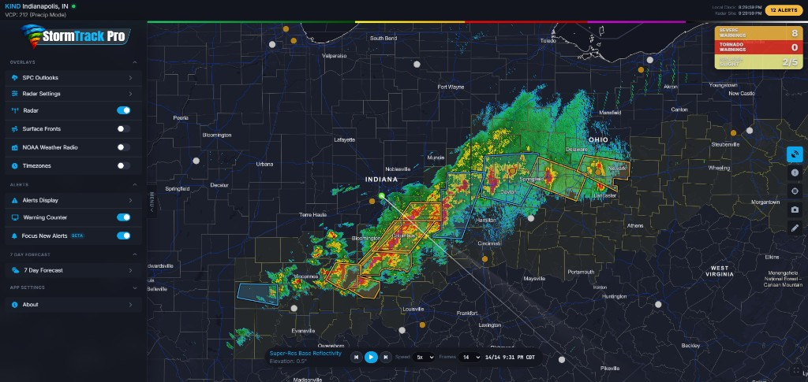

# StormTrack Pro

A web-based weather toolkit. It pulls live data from NWS and other public sources to give you radar, alerts, surface observations, and more — all in your browser.

## Website

You can find a live version here: **https://stormtrack.snapsera.com/**

## Screenshot



## What it does

- **NEXRAD radar** — Plots Level 2 and Level 3 data from any NEXRAD site in the US. Supports reflectivity, velocity (with dealiasing), and a bunch of other products. Includes a national composite view, radar looping, and a data inspector for reading values off the map.
- **Weather alerts** — NWS warnings, watches, and advisories drawn on the map with full text and polygon display. Includes SPC watches, mesoscale discussions, and outlooks. An alert ticker scrolls active alerts across the bottom, and audible/voice alerts can notify you of new warnings.
- **Lightning** — Real-time lightning strike plotting.
- **METARs** — Surface observations from ASOS/AWOS stations, plotted as station models on the map.
- **Surface fronts** — Frontal boundaries and pressure systems overlaid on the map.
- **Hurricanes** — NHC tropical cyclone tracks and forecast cones.
- **SPC products** — Storm Prediction Center outlooks, watches, and mesoscale discussions.
- **Weather stations** — Upper air sounding data and detailed station info.
- **Radio** — NWR (NOAA Weather Radio) and scanner audio streams.
- **Drawing tools** — Freehand annotation on the map for analysis or presentation.
- **Screenshots** — Capture any region of the map and save it to disk.
- **7 Day Forecast** — Search by city, state, or zip code to view a full 7-day forecast powered by the NWS API. Includes current conditions (temperature, wind, humidity, dew point, pressure, visibility), sunrise/sunset times, moon phase, hourly forecast (72 hours), severe weather alerts with full details, and expandable day-by-day text forecasts. Supports favorites and recent search history.
- **Timezones** — Display and switch between local time and the radar site's time zone.

## Project layout

```
app/                Application source (modules organized by feature)
  alerts/           NWS alert fetching, parsing, rendering, and polygon display
  core/             App shell, map setup, menus, popups, clock, entry point
  devtools/         Internal developer/testing tools
  draw/             Map drawing/annotation tools
  forecast/         7-day forecast modal (NWS API, geocoding, sun/moon calculations)
  hurricanes/       NHC tropical cyclone tracks
  lightning/        Lightning strike data
  metars/           METAR parsing and station model plotting
  radar/            NEXRAD decoding (libnexrad), plotting, colormaps, looping, inspector
  radio/            NWR / scanner audio streams
  screenshot/       Map screenshot capture
  spc/              SPC outlooks, watches, MDs
  surface_fronts/   Surface analysis fronts
  timezones/        Timezone display and selection
  ui/               Shared UI components (alert ticker, audible alerts, voice, fullscreen)
  weather_station/  Station info and upper-air data
data/               Static data files and palettes
dist/               Bundled output (generated by build)
images/             App icons and SVG assets
lib/                Vendored libraries (bzip2 decompression)
scripts/            Build scripts (CSS concatenation, icon generation)
styles/             CSS source files (split by feature, concatenated at build time)
tools/              Changelog and bundle-size tracking utilities
```

## Tech

- **Mapbox GL JS** for the map
- **Browserify + brfs** for bundling
- **WebGL (custom GLSL shaders)** for radar rendering
- Radar decoding is done entirely client-side, including bzip2 decompression (Level 2) and various NEXRAD message parsers
- **Express** serves the frontend (`server.js` on port 3000)

## Getting started

```bash
npm install
npm run build
```

`npm run build` concatenates CSS source files into `index.css`, bundles JS with Browserify, and minifies with UglifyJS.

### Running

```bash
npm run start          # starts the Express server (port 3000)
npm run dev            # builds first, then starts the server
```

Open `http://localhost:3000` in your browser.

## Credits

This project was built using [AtticRadar](https://github.com/SteepAtticStairs/AtticRadar) by [SteepAtticStairs](https://github.com/SteepAtticStairs) as a base and reference. AtticRadar is a clean, powerful weather toolkit for the browser that includes NEXRAD parsing and plotting, doppler velocity dealiasing, weather alerts, real-time lightning data, METAR station data, and more. Much of the foundational architecture, NEXRAD decoding logic, and WebGL radar rendering in StormTrack Pro originates from or was inspired by AtticRadar's codebase.

## License

Not currently published under an open-source license. All rights reserved.
