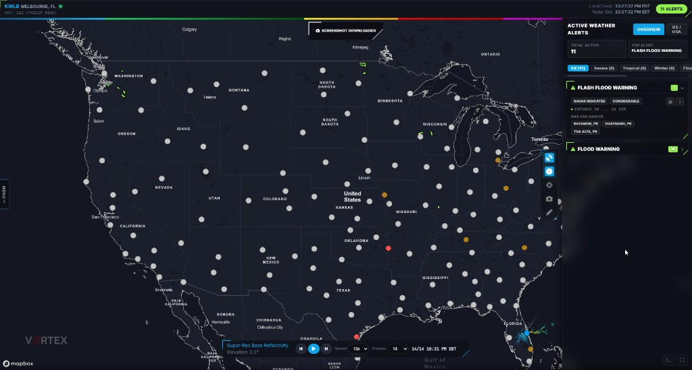
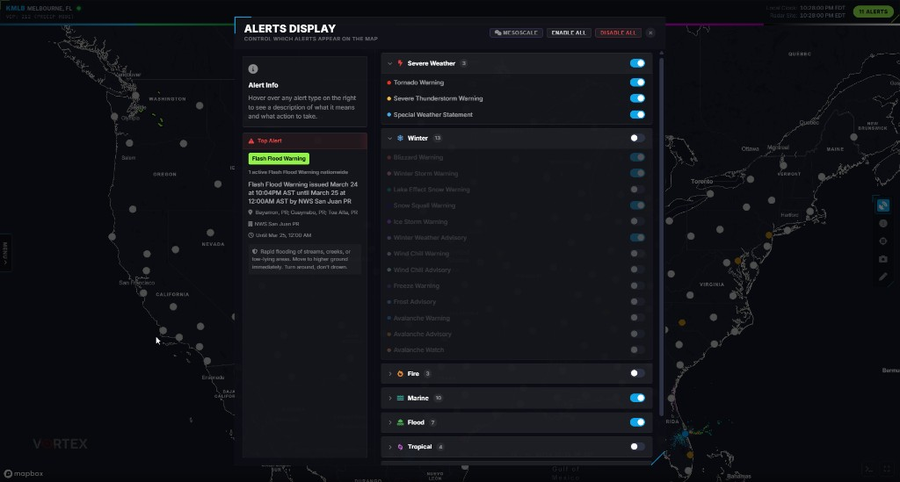
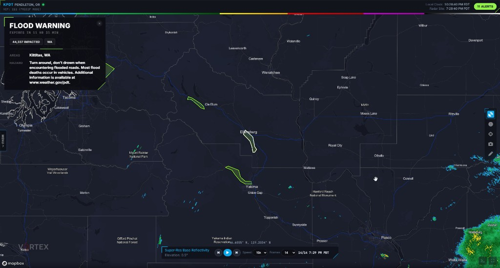
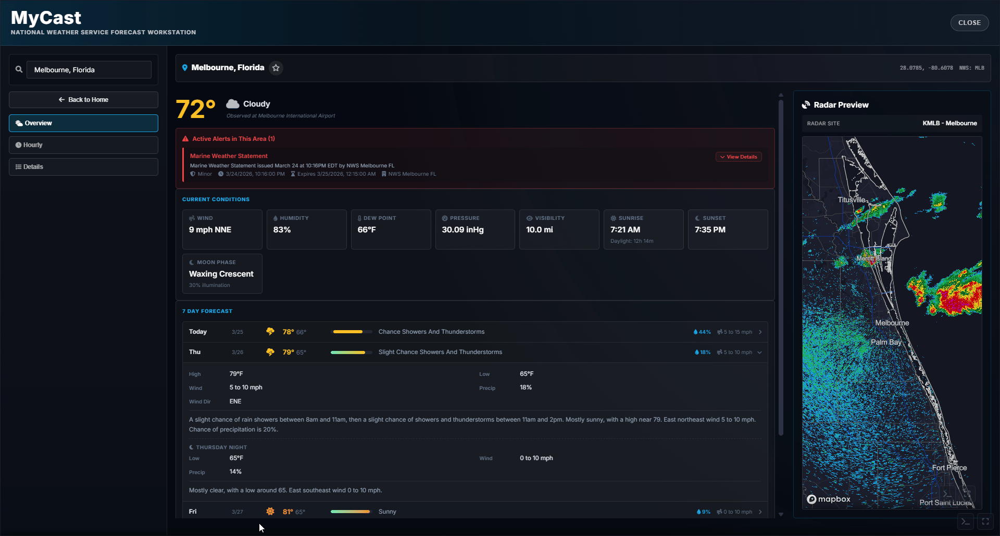

# Vortex Radar 🌪️


Browser-based weather radar and alerts. Pulls live data from the NWS and other public sources: radar, warnings, surface obs, lightning, and more.

> **Project rename:** This project was renamed from **StormTrack Pro** to **Vortex Radar**.

## 🌐 Website

You can view the live version here: [vortexradar.snapsera.com](https://vortexradar.snapsera.com/)

## 🖼️ Showcase










## ✨ Features

- **NEXRAD radar** — Level 2 & Level 3 from any US NEXRAD site. Reflectivity, velocity (with dealiasing), and a bunch of other products. National composite, looping, and a data inspector.
- **24/7 Live Mode** — Autonomous weather broadcast mode that rotates between SPC outlooks, active severe warnings, CONUS radar, local spotlight segments, storm reports, and recent earthquakes.
- **Live commentary + soundtrack** — Typewriter-style commentary with alert-first callouts, plus built-in background music controls for stream-style viewing.
- **National MRMS radar loop** — CONUS base reflectivity from NOAA nowCOAST with multi-frame playback and smooth endpoint dwell for cleaner animation.
- **Alerts** — Warnings, watches, advisories drawn on the map with polygons and full text. SPC watches, MDs, outlooks. Ticker along the bottom, plus audible/voice notifications.
- **Lightning** — Real-time strike plotting.
- **METARs** — Station models from ASOS/AWOS sites.
- **Surface fronts** — Frontal boundaries and pressure systems.
- **Hurricanes** — NHC tracks and forecast cones.
- **SPC** — Outlooks, watches, mesoscale discussions.
- **Weather stations** — Upper-air soundings and station info.
- **Radio** — NWR and scanner streams.
- **Drawing** — Freehand annotation on the map.
- **Screenshots** — Save any region of the map.
- **7-Day Forecast** — City/state/zip, current conditions, hourly out to 72h, day-by-day text forecasts.
- **Change Log panel** — In-app changelog modal with day tabs so you can quickly see what changed in recent builds.

## 🗺️ Roadmap

Progress bars below are a living snapshot of where Vortex Radar stands today and what is planned next.

### Current App Progress

- Core platform maturity: `█████████░` **90%**
- Live weather coverage: `████████░░` **85%**
- UI/UX polish: `███████░░░` **70%**
- Desktop packaging + release flow: `██████░░░░` **65%**
- Performance and optimization pass: `██████░░░░` **60%**

### Feature Completion

- NEXRAD radar + national loop: `██████████` **100%**
- Alerts + polygons + ticker/voice: `█████████░` **90%**
- 24/7 Live Mode engine: `████████░░` **80%**
- Forecast experience (hourly + 7-day): `███████░░░` **75%**
- Lightning/METAR/fronts/SPC overlays: `████████░░` **80%**
- Hurricanes and tropical tools: `███████░░░` **70%**
- Desktop app + updater reliability: `██████░░░░` **65%**

### Future Plans (In Progress / Planned)

- Multi-region camera expansion + smarter rotation: `██████░░░░` **60%**
- Live Mode segment customization controls: `█████░░░░░` **50%**
- Map performance tuning for low-end GPUs: `████░░░░░░` **40%**
- Mobile responsiveness improvements: `███░░░░░░░` **30%**
- Better onboarding/help and discoverability: `███░░░░░░░` **30%**
- Testing/QA automation coverage: `██░░░░░░░░` **20%**

## 🗂️ Project layout

```text
app/                Source, organized by feature
  alerts/           Alert fetching, parsing, rendering, polygons
  core/             App shell, map, menus, popups, clock, entry point
  devtools/         Dev/testing tools
  draw/             Drawing/annotation
  forecast/         7-day forecast modal
  hurricanes/       Tropical cyclone tracks
  lightning/        Lightning data
  metars/           METAR parsing and station models
  radar/            NEXRAD decoding, plotting, colormaps, looping, inspector
  radio/            NWR / scanner streams
  screenshot/       Map capture
  spc/              SPC outlooks, watches, MDs
  surface_fronts/   Fronts overlay
  timezones/        Timezone display
  ui/               Shared UI (ticker, audible alerts, voice, fullscreen)
  weather_station/  Station info, upper-air data
data/               Static data and palettes
dist/               Build output
images/             Icons and SVGs
lib/                Vendored libs (bzip2)
scripts/            Build scripts
styles/             CSS source (concatenated at build)
tools/              Changelog, bundle-size utils
```

## 🧰 Tech

- **Mapbox GL JS** for the map
- **Browserify + brfs** for bundling
- **WebGL** with custom GLSL shaders for radar rendering
- All radar decoding happens client-side — bzip2 decompression, NEXRAD message parsing, the whole thing
- **Express** serves the app (`server.js`, port 3000)

## 🚀 Getting started

```bash
npm install
npm run build
```

`npm run build` concats CSS, bundles JS with Browserify, and minifies with UglifyJS.

```bash
npm run start          # Express server on port 3000
npm run dev            # build + start
```

Then open `http://localhost:3000`.

## 💻 Desktop app (super simple)

This project can build and publish a Windows desktop app with auto-updates through GitHub Releases.

### ✅ One-time setup

1. Install dependencies:

```bash
npm install
```

1. Create a GitHub Personal Access Token (classic `repo` scope is easiest), then save it once on Windows:

```powershell
setx GH_TOKEN "YOUR_GITHUB_TOKEN"
```

1. Restart Cursor/terminal after running `setx`.

### 🏗️ Build desktop app locally (no publish)

```bash
npm run desktop:dist
```

Output goes to:

- `release-build/win-unpacked/` (unpacked app)
- `release-build/Vortex Radar Setup.exe` (installer)

### 📦 Publish a release to GitHub (auto-update)

Run this when you want users to get an update:

```bash
npm run desktop:publish
```

What it does automatically:

- Bumps patch version (`1.0.x -> 1.0.x+1`)
- Builds web assets
- Builds desktop installer
- Uploads release artifacts to GitHub (`snapsera/vortexradar`)

### 🔎 Optional check before publish

```bash
npm run desktop:preflight
```

This checks token + repo permissions and also bumps patch version.

### 🧪 Quick release checklist

1. Make your code changes
2. Run `npm run desktop:publish`
3. Verify new release appears on GitHub
4. Open installed app and confirm update prompt appears

### 🛠️ Common issues

- **"GitHub Personal Access Token is not set"**
  - Reopen terminal/Cursor after `setx`
  - Verify token exists with:
    - `echo $env:GH_TOKEN` (PowerShell)
- **`EPERM ... bundle.js` build error**
  - Close running app/build processes
  - Delete stale temp files:
    - `Remove-Item .\dist\bundle.js.tmp-browserify-* -Force -ErrorAction SilentlyContinue`
  - Re-run publish
- **Security reminder 🔐**
  - Never paste your token in chat/screenshots/terminal logs
  - If exposed, revoke and create a new token immediately

## 🙌 Credits

Built on top of [AtticRadar](https://github.com/SteepAtticStairs/AtticRadar) by [SteepAtticStairs](https://github.com/SteepAtticStairs). A lot of the core architecture, NEXRAD decoding, and WebGL rendering here started from or was heavily inspired by that project. Go check it out.

## 📄 License

Not currently published under an open-source license. All rights reserved.
